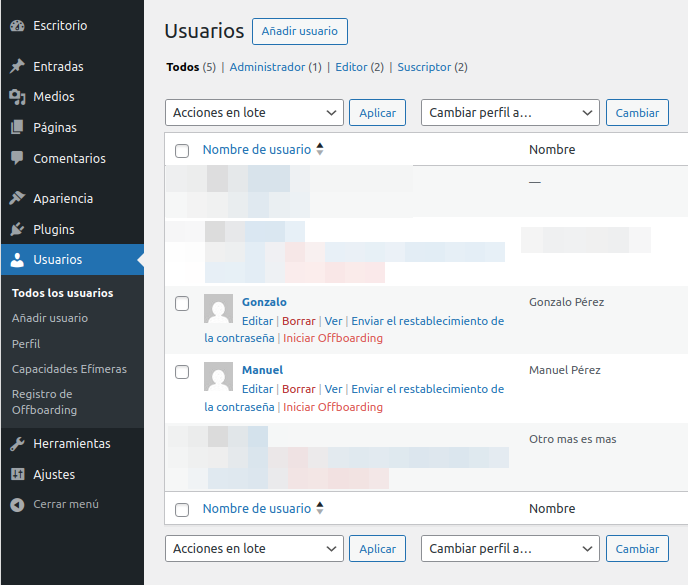
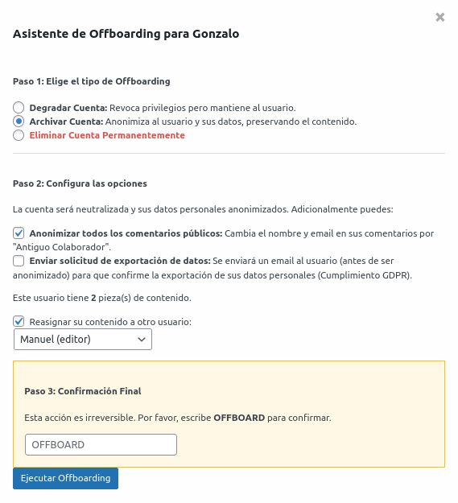
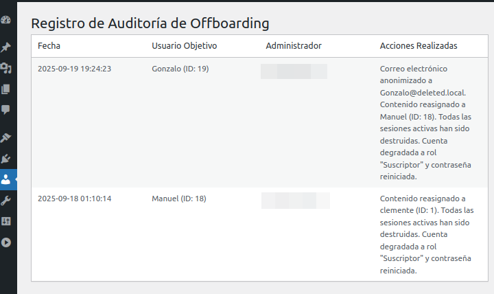

# WP Offboard Assistant 🧙‍♂️

**Colaboradores:** [soyunomas](https://github.com/soyunomas)

**Etiquetas:** users, admin, security, offboard, delete user, archive user, gdpr, user management

Un plugin para WordPress, seguro y guiado, para optimizar el proceso de dar de baja a usuarios, gestionar el ciclo de vida del usuario y cumplir con las normativas de privacidad.

## Descripción 🛡️

**WP Offboard Assistant** transforma el proceso de dar de baja a usuarios en un flujo de trabajo seguro, guiado y versátil. Se integra directamente en la pantalla de Usuarios de WordPress para ayudar a los administradores a gestionar correctamente la salida de un colaborador.

Con la versión 1.1.0, el plugin ahora ofrece tres flujos de trabajo distintos: **Degradar, Archivar y Eliminar**. La nueva opción "Archivar" está diseñada para el cumplimiento de normativas de privacidad (como GDPR/LOPD), permitiendo anonimizar los datos personales de un usuario sin destruir el contenido asociado, preservando así la integridad del sitio.

Todo el proceso está impulsado por una mentalidad de "la seguridad primero" (security-first), protegiendo contra vulnerabilidades como **CSRF**, acceso no autorizado y manejo inseguro de datos.

## Características ✨

### Tres Modos de Offboarding Flexibles:

*   **🆕 Archivar Cuenta (No Destructivo):** La opción ideal para la privacidad y la preservación de datos.
    *   **Anonimización del Perfil:** Reemplaza datos personales como email, nombre y URL con valores genéricos (ej. `Antiguo Colaborador`).
    *   **Anonimización de Comentarios:** Modifica todos los comentarios públicos del usuario para eliminar su nombre y email.
    *   **Cumplimiento GDPR/LOPD:** Permite iniciar una solicitud de exportación de datos personales al correo del usuario antes de que sea anonimizado.
    *   **Neutralización de la Cuenta:** Elimina todos los roles y reinicia la contraseña a un valor aleatorio e irrecuperable, bloqueando el acceso de forma efectiva.

*   **Degradar Cuenta:** Una opción segura para revocar privilegios sin eliminar al usuario.
    *   Cambia el rol del usuario a 'Suscriptor'.
    *   Reinicia su contraseña a una cadena larga, aleatoria y segura.

*   **Eliminar Cuenta Permanentemente:** La acción final para borrar por completo al usuario.
    *   Elimina permanentemente el registro del usuario de la base de datos.
    *   Ofrece reasignar su contenido para evitar que quede huérfano.

### Funcionalidades Comunes y Fundamentos de Seguridad:

*   🧙‍♂️ **Asistente Guiado y Condicional:** Un proceso intuitivo de varios pasos que muestra solo las opciones relevantes para la acción que has elegido.
*   🔄 **Reasignación de Contenido Segura:** Reasigna las entradas de un usuario a otro que tenga privilegios suficientes. El selector muestra el **nombre de usuario y su rol** (ej. Editor) para una decisión más informada.
*   🚫 **Destrucción de Sesiones:** Cierra automáticamente todas las sesiones de inicio de sesión activas para el usuario, revocando su acceso de inmediato (en los modos Degradar y Archivar).
*   📋 **Registro de Auditoría Detallado:** Guarda un registro de cada acción de offboarding, incluyendo qué administrador la realizó, sobre quién, cuándo y qué acciones específicas se tomaron.
*   ⚠️ **Confirmación de Acción Irreversible:** Requiere que el administrador escriba "OFFBOARD" para evitar clics accidentales.
*   🛡️ **Fundamentos de "Security-First":**
    *   Protección **CSRF** usando Nonces en todas las acciones.
    *   Comprobación de permisos (`manage_options`) para asegurar que solo los administradores puedan actuar.
    *   Validación y saneamiento estricto de datos en todas las entradas.
    *   Consultas seguras a la base de datos usando `$wpdb->prepare()`, `$wpdb->insert()` y `$wpdb->update()`.

## Instalación 🚀

1.  Descarga el archivo ZIP de la última versión desde el [repositorio de GitHub](https://github.com/soyunomas/wp-offboard-assistant/releases).
2.  En tu panel de administración de WordPress, ve a **Plugins > Añadir nuevo**.
3.  Haz clic en **Subir plugin** y selecciona el archivo ZIP que descargaste.
4.  Activa el plugin.
5.  Ve a la pantalla **Usuarios > Todos los usuarios**. Ahora verás un enlace "Iniciar Offboarding" en las acciones de cada usuario (excepto en el tuyo).

## Capturas de Pantalla 📸

1.  **El enlace "Iniciar Offboarding" en la lista de usuarios.**
   
    

2.  **Asistente para degradar cuenta y reasignación de posts**
   
    

3.  **Asistente multi-paso: elección del tipo de offboarding y opciones condicionales para "Archivar".**
   
     

4.  **La página de registro de auditoría, mostrando un registro detallado de una acción de 'Archivado'.**
   
    

## Preguntas Frecuentes (FAQ) ❓

**¿Cuál es la diferencia entre "Archivar" y "Eliminar"?**
**Eliminar** es una acción destructiva que borra permanentemente al usuario de la tabla `wp_users`. El contenido debe ser reasignado o será eliminado también. Es irreversible.
**Archivar** es una acción no destructiva enfocada en la privacidad. Mantiene el registro del usuario en la base de datos (preservando su ID) pero reemplaza toda su información personal identificable con datos anónimos. Esto neutraliza la cuenta y cumple con el "derecho al olvido" sin romper la integridad de los datos del sitio.

**¿Qué pasa si no reasigno el contenido y elijo eliminar el usuario?**
Si seleccionas "No reasignar" y procedes a eliminar el usuario, todas las entradas de las que ese usuario es autor serán eliminadas permanentemente. Este es el comportamiento por defecto de WordPress, gestionado por la función `wp_delete_user()`.

**¿Puedo darme de baja a mí mismo?**
No. Por razones de seguridad, el enlace "Iniciar Offboarding" no se muestra para tu propia cuenta de usuario, y la lógica del servidor incluye una comprobación para evitar esta acción.

**¿A qué perfiles de usuario puedo reasignar el contenido?**
El plugin valida de forma inteligente que el usuario de destino para la reasignación tenga el permiso `edit_others_posts`. Esto evita reasignar contenido accidentalmente a usuarios que no pueden gestionarlo, como los Suscriptores.

## Historial de Cambios 📜

### 1.1.0
*   **¡NUEVA CARACTERÍSTICA: Modo de Archivador!** Se añade una tercera opción de offboarding no destructiva, centrada en la privacidad.
*   **Anonimización de Perfil y Comentarios:** El modo Archivar limpia los datos personales del perfil del usuario y de todos sus comentarios.
*   **Integración con GDPR:** El modo Archivar puede iniciar una solicitud de exportación de datos personales de WordPress antes de la anonimización.
*   **Refactorización del Backend:** La lógica AJAX se ha reestructurado para manejar limpiamente los tres flujos de offboarding (Degradar, Archivar, Eliminar).
*   **Interfaz de Usuario Mejorada:** El modal ha sido rediseñado como un asistente de varios pasos con lógica condicional para una experiencia más clara e intuitiva.

### 1.0.0
*   Lanzamiento inicial.
