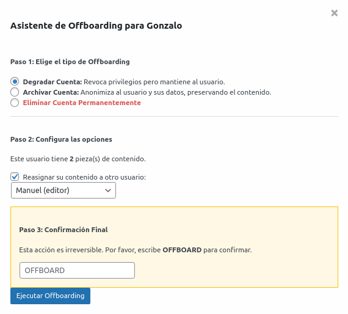

# WP Offboard Assistant 🧙‍♂️

**Colaboradores:** [soyunomas](https://github.com/soyunomas)

**Etiquetas:** users, admin, security, offboard, delete user, user management

Un plugin para WordPress, seguro y guiado, para optimizar el proceso de dar de baja a usuarios mediante la reasignación de contenido, el reinicio de contraseñas y la eliminación de cuentas.

## Descripción 🛡️

**WP Offboard Assistant** proporciona un asistente seguro basado en un modal en la pantalla de Usuarios de WordPress para ayudar a los administradores a dar de baja a los usuarios correctamente. Cuando un empleado o colaborador se va, simplemente eliminar su cuenta puede dejar contenido huérfano o crear descuidos de seguridad. Este plugin garantiza un proceso completo y seguro.

Todo el proceso está impulsado por una mentalidad de "la seguridad primero" (security-first), protegiendo contra vulnerabilidades comunes como **CSRF**, acceso no autorizado y manejo inseguro de datos.

## Características ✨

*   🧙‍♂️ **Asistente Guiado en un Modal:** Un proceso intuitivo paso a paso que se inicia directamente desde la lista de usuarios.
*   🔄 **Reasignación de Contenido:** Reasigna de forma segura las entradas de un usuario a otro que tenga privilegios suficientes. El selector muestra el **nombre de usuario y su rol** (ej. Editor) para una decisión más informada.
*   🔒 **Acciones Seguras sobre la Cuenta:**
    *   📧 **Anonimizar Correo Electrónico:** Opción para cambiar el email del usuario a un valor ficticio (ej. `usuario@deleted.local`), impidiendo la recuperación de contraseña.
    *   **Degradar Cuenta:** Cambia el perfil del usuario a 'Suscriptor' y reinicia su contraseña a una cadena larga, aleatoria y segura.
    *   **Eliminar Cuenta:** Borra permanentemente al usuario de la base de datos.
*   🚫 **Destrucción de Sesiones:** Cierra automáticamente todas las sesiones de inicio de sesión activas para el usuario que se está dando de baja, revocando su acceso de inmediato.
*   ⚠️ **Confirmación de Acción Irreversible:** Requiere que el administrador escriba "OFFBOARD" para evitar clics accidentales.
*   📋 **Registro de Auditoría:** Guarda un registro de cada acción de offboarding, incluyendo qué administrador la realizó, sobre quién, cuándo y qué acciones se tomaron.
*   🛡️ **Enfocado en la Seguridad:**
    *   Protección **CSRF** usando Nonces en todas las acciones.
    *   Comprobación de permisos (`manage_options`) para asegurar que solo los administradores puedan actuar.
    *   Validación y saneamiento estricto de datos en todas las entradas.
    *   Consultas seguras a la base de datos usando `$wpdb->prepare()` y `$wpdb->insert()`.

## Instalación 🚀

1.  Descarga el archivo ZIP de la última versión desde el [repositorio de GitHub](https://github.com/soyunomas/wp-offboard-assistant).
2.  En tu panel de administración de WordPress, ve a **Plugins > Añadir nuevo**.
3.  Haz clic en **Subir plugin** y selecciona el archivo ZIP que descargaste.
4.  Activa el plugin.
5.  Ve a la pantalla **Usuarios > Todos los usuarios**. Ahora verás un enlace "Iniciar Offboarding" en las acciones de cada usuario (excepto en el tuyo).

## Capturas de Pantalla 📸

1.  **El enlace "Iniciar Offboarding" en la lista de usuarios.**
    

2.  **El asistente modal, mostrando las opciones de reasignación (con roles), anonimización de email y acción final.**
    

3.  **La página de registro de auditoría, mostrando un registro de un offboarding completado.**
    

## Preguntas Frecuentes (FAQ) ❓

**¿Qué pasa si no reasigno el contenido y elijo eliminar el usuario?**
Si seleccionas "No reasignar" y procedes a eliminar el usuario, todas las entradas de las que ese usuario es autor serán eliminadas permanentemente. Este es el comportamiento por defecto de WordPress, gestionado por la función `wp_delete_user()`.

**¿Puedo darme de baja a mí mismo?**
No. Por razones de seguridad, el enlace "Iniciar Offboarding" no se muestra para tu propia cuenta de usuario, y la lógica del servidor incluye una comprobación para evitar esta acción.

**¿A qué perfiles de usuario puedo reasignar el contenido?**
El plugin valida de forma inteligente que el usuario de destino para la reasignación tenga el permiso `edit_others_posts`. Esto evita reasignar contenido accidentalmente a usuarios que no pueden gestionarlo, como los Suscriptores.

## Historial de Cambios 📜

### 1.0.0
*   Lanzamiento inicial.
